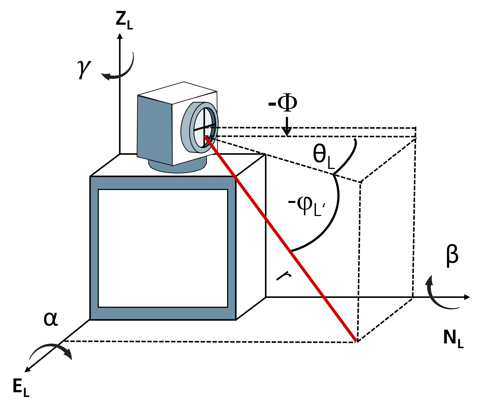
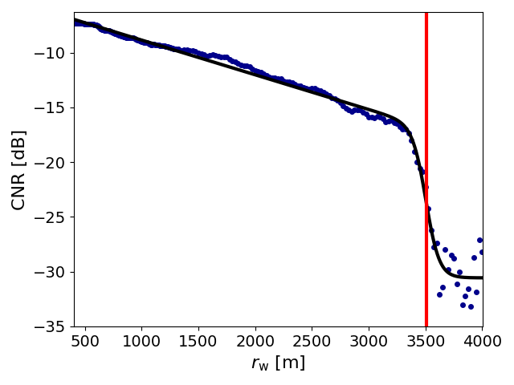
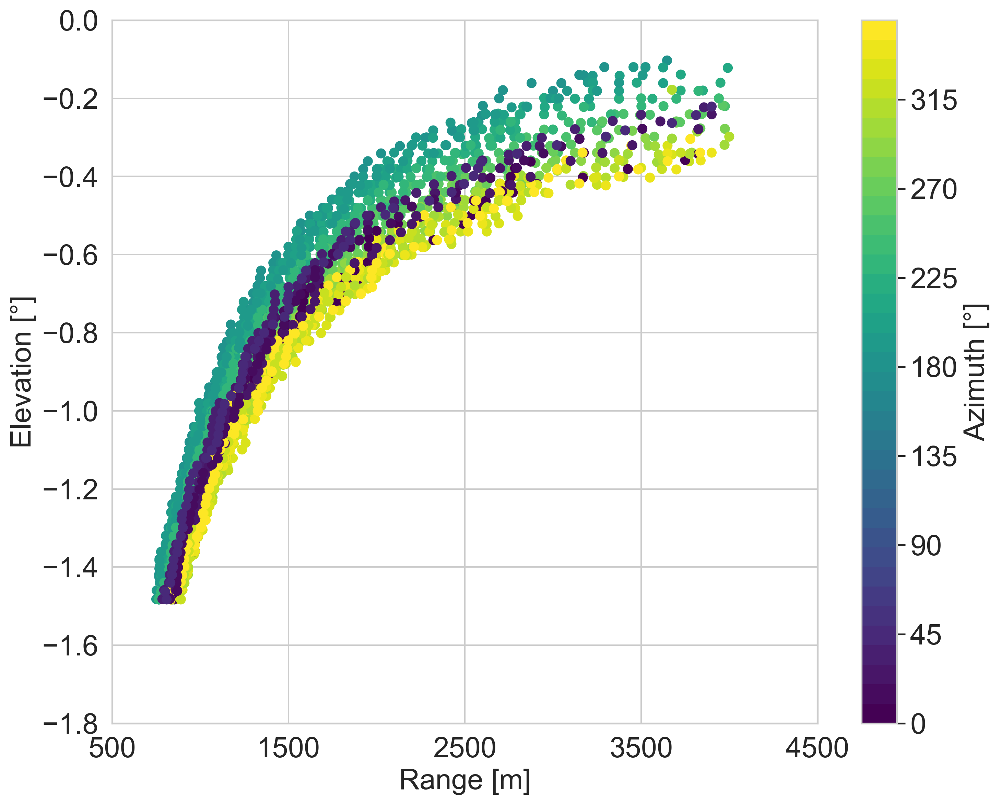
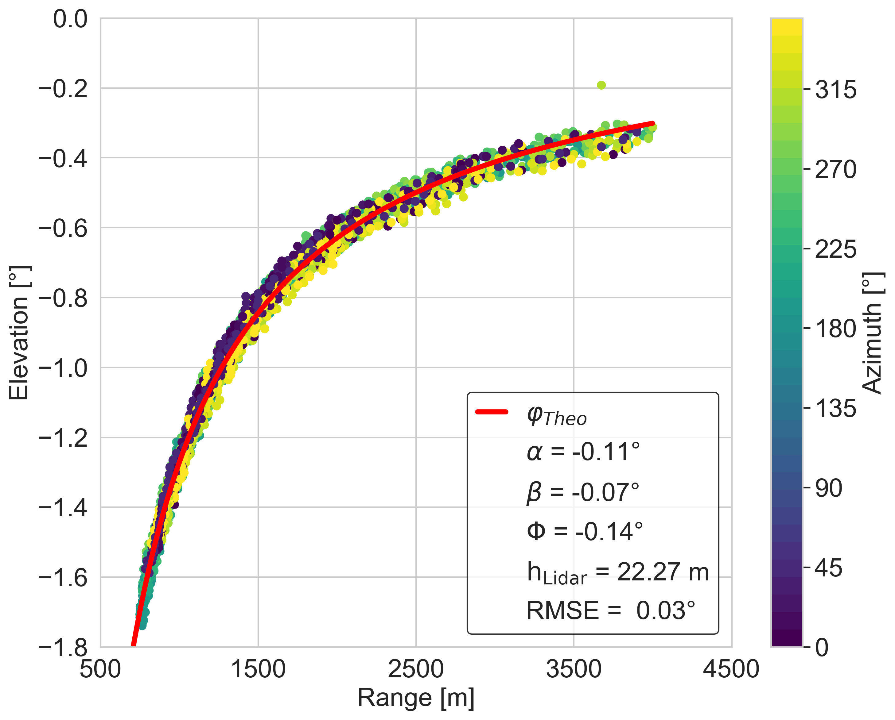

# xssl - eXtended Sea Surface Levelling Method for Scanning Lidar Calibration

This project implements the **extended Sea Surface Levelling (SSL)** method for the calibration of 
scanning lidar measurements using a flat water surface.
The theoretical background and detailed derivation of the method are described extensively in *Gramitzky et al. (2025)*
(see References below). Some of the code's fundamentals were adopted from Rott et al. 2021b.

The extended SSL method is used to estimate the tilting of a scanning lidar system offshore.
In addition, a vertical displacement of the laser beam independent of the azimuth angle (elevation offset) can be 
determined, e.g. caused by misalignment of mirrors. The results of the extended SSL method are:

- **Pitch**
- **Roll**
- **Elevation offset**


The motivation for this method arises from the fact that at measurement distances of several kilometers, even very small 
angular misalignments can lead to distance errors of several meters. For offshore calibration of scanning lidar systems, 
a flat water surface provides a natural reference target that can be exploited for this purpose.

This repository offers functions for performing the extended SSL method on a set of measurement data.
---

## Method
A detailed description of the method can be found in *Gramitzky et al. 2025*.
For the application of the extended SSL method, carrier-to-noise ratio (CNR) values as a function of range are required
at points where the laser beam intersects the sea surface under different:
- elevation angles
- azimuth angles

It is not relevant whether the data was acquired using:
- Range Height Indicator (RHI) scans, or
- Plan Position Indicator (PPI) scans.

The essential requirements are:
- a large azimuth coverage (ideally close to 360°) to estimate **pitch and roll**, and
- a sufficient elevation angle range to determine the **elevation offset**.

---
## Coordinate System Definition

<figure>
  
  <figcaption style="font-style: italic;">
    Coordinate system of a scanning lidar
  </figcaption>
</figure>

All computations in this project are performed in the following coordinate system:

- x-axis: points eastward $E_L$ 
- y-axis: points northward $N_L$ 
- z-axis: points upward $Z_L$

Additional definitions:

- A negative elevation angle $\varphi$ means that the laser beam is directed downward.
- The azimuth angle $\theta$ is defined as positive clockwise.
- Pitch, roll, and yaw are defined in a left-handed coordinate system:
  - Pitch $\alpha$ is positive for a downward tilt toward the north
  - Roll $\beta$ is positive for a downward tilt toward the west

The north offset (yaw) $\gamma$ is defined as zero in this project and cannot be determined using the extended SSL method.  
To estimate yaw, a hard target mapping of a known structure is required.

A positive elevation offset $\Phi$ indicates that the laser beam is emitted too high, independent of azimuth angle.  
This can occur due to internal misalignments in the scanning head.

All input and output data is interpreted within this coordinate system.

---
## How to use the code

To get started:

- Get a local copy of the repository and move into the project directory:

```
git clone https://github.com/kiralg/xssl/xssl.git
cd xssl
```

- (Optional but recommended) Create and activate a virtual environment:

```
python -m venv .venv
source .venv/bin/activate      # Linux / macOS
.venv\Scripts\activate         # Windows
```

- Install the required packages:

```text
pip install -r support/requirements.txt
```

- Install the project as a Python package so it can be imported by the example script:

```
pip install .
```

- After installation, you can run the example application with:
```
python scripts/example_xssl.py
```

> ⚠️ **Attention**
>
> The default configuration uses `cpu=6` for the analysis. Depending on your hardware, you may need to adjust this value. 
> Using more CPU cores can improve performance.
> 
> To change the number of CPUs used, modify the `cpu` parameter in the `wrapper_parallel_distance_analysis`
> function call in the `example_xssl` script.  
> For more configuration options, see `xssl.wrapper_parallel_distance_analysis`.


---

## Project Structure and Workflow

The processing workflow consists of two main steps.

### Step 1: Distance Estimation to the Water Surface

The distance of the scanning lidar for a specific elevation and azimuth angle to the water surface is estimated from 
CNR over range data using the function:

```text
wrapper_parallel_distance_analysis
```
Defined in the following script:

```text
src/xssl/func_cnr_over_range.py
```

**Requirements**

- A unique timestamp is required to associate each measurement for a specific elevation and azimuth angle.

**Input Data**

- The function requires a pandas.DataFrame containing CNR over range data with the following columns:

```text
'range' (float): Distance value along the laser beam

'cnr' (float): Carrier-to-noise ratio data

'elevation' (float): Elevation angle of the laser beam (constant per timestamp)

'azimuth' (float): Azimuth angle of the laser beam (constant per timestamp)

'timestamp' (datetime): Unique timestamp identifying each scan
```

- In addition, a second DataFrame containing boundary values for the optimisation must be provided.
The optimisation boundaries are adapted to the *sigmoid_lin_function*, which is used to fit the data.
The following boundaries must be specified:

```text
high_cnr_ub: upper boundary for high CNR values

high_cnr_lb: lower boundary for high CNR values

low_cnr_ub: upper boundary for low CNR values

low_cnr_lb: lower boundary for low CNR values

distance_ub: upper boundary for distance

distance_lb: lower boundary for distance

growth_ub: upper boundary for growth parameter

growth_lb: lower boundary for growth parameter

a_ub: upper boundary for linear factor a

a_lb: lower boundary for linear factor a

```

- An example for the boundary data for the *sigmoid_lin_function* is provided in:

```text
data/bound_cnr_over_range.csv
```

- The analysis is parallelised, and the number of CPUs can be specified depending on the available hardware.

- If $plot=True$, plots of the CNR over range data together with the estimated water surface distance are generated.

**Output of Step 1**
- A CSV file containing the estimated distance to the water surface for each timestamp

- Optional plots of CNR over range data and the estimated range, where the laser beam hits the water surface, 
useful for:
    - validating results 
    - adjusting optimisation bounds
    - assessing data quality

**Example plot**

<figure style="width: 350px;">
  
  <figcaption style="text-align: center; font-style: italic;">
    CNR over range data for a single time step. The red line marks the distance where the laser hits the water surface.
  </figcaption>
</figure>


### Step 2: Extended SSL Optimization

In the second step, the optimisation of the extended SSL model using the distance estimates obtained in Step 1 
for multiple azimuth and elevation angles is performed using the function:

```text
ssl_wrapper
```

Defined in the following script:

```text
src/xssl/func_xssl.py
```

**Input Data**
- The function requires a pandas.DataFrame containing the estimated distance to the water surface for each timestamp 
resulting from Step 1.
- In addition, defined filters can be applied to the data, e.g. to remove outliers.
- The parameter distance correction is available in the function so that the previously determined distance 
can be corrected. For more information, see Gramitzky et al. 2025.

**Output of Step 2**

- The optimisation returns the following parameters as a pandas.DataFrame:

```text
Pitch

Roll

Elevation offset

Lidar height (treated as an unknown and optimized simultaneously)

Root Mean Square Error (RMSE)
```
*The RMSE provides a quantitative measure of how well the model fits the data given the estimated parameters.*

**Visualisation**

- The results of the extended SSL optimization can be visualised using the function:

```text
plot_ssl_results
```
Example plots:

<div style="display: flex; gap: 20px; flex-wrap: wrap; justify-content: center;">

  <figure style="width: 350px;">
    
    <figcaption style="text-align: center;">
      <em>Dependence of elevation, range (distance to water surface) and azimuth values on SSL data</em>
    </figcaption>
  </figure>

  <figure style="width: 350px;">
    
    <figcaption style="text-align: center;">
      <em>Example of tilt-corrected elevation data from SSL across the range depending on azimuth angle and the model
(red line) with pitch, roll, elevation offset, lidar height and RMSE</em>
    </figcaption>
  </figure>

</div>


### Example Application

An example of the method is provided under:

```text
scripts/example_xssl/
```

Example datasets are provided in:

```text
data/cnr_over_range_rhi1.csv
```
---


## References

The sample data originates from the WINDOW project, which was conducted from Fraunhofer IEE in collobaration with 
the project partner EnBW.

Gramitzky, K., Jäger, F., Callies, D., Hildebrand, T., Lundquist, J. K., and Pauscher, L.: 
Alignment of Scanning Lidars in Offshore Campaigns – an Extension of the Sea Surface Levelling Method, 
Wind Energ. Sci. Discuss. [preprint], https://doi.org/10.5194/wes-2025-191, in review, 2025. 

Rott, A., Schneemann, J., and Theuer, F.: AndreasRott/Alignment_of_scanning_lidars_in_offshore_wind_farms: Version1.0, 
Zenodo [code], https://doi.org/10.5281/zenodo.5654919 , 2021b.

---
## License

This project is licensed under the GNU GPLv3. See LICENSE for details.

---

## Citation
If you use this software in your research, please cite it and the corresponding paper Gramitzky et al. (2025).

---

## Authors

- **Kira Gramitzky** – main code implementation, testing, scientific analysis 
- **Luis Michaelis** – software architecture, feedback, support in finalising the project 

